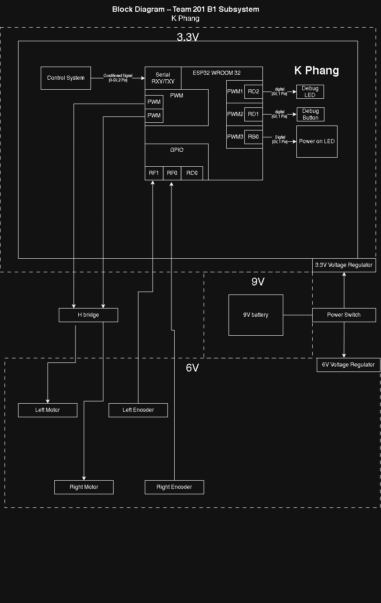

## Overview

This block diagram documents the architecture of the Team 201 B1 propulsion subsystem and how it interfaces with the team control subsystem. It highlights the major functional blocks, power rails, and signal connections used to drive two DC motors with encoder feedback.

Key items shown in the diagram:

- **Power source:** 9V battery feeding a **power switch**
- **Power rails:** 9V is regulated into:
  - **3.3V rail** for ESP32 logic and UART interface
  - **6V rail** for the motor supply through the H-bridge driver
- **Team connection:** **UART RX/TX** link between the Control Subsystem and the ESP32
- **Actuators:** Left and Right DC motors driven through an **H-bridge**
- **Sensors:** Left and Right **encoders** providing feedback to the ESP32 for speed control
- **Debugging:** Debug LED, debug button, and power-on LED for bring-up and troubleshooting

## Propulsion Subsystem Block Diagram

