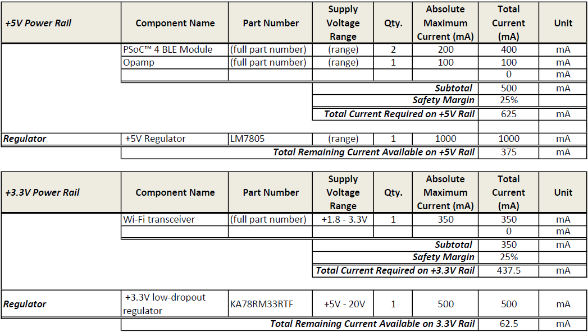
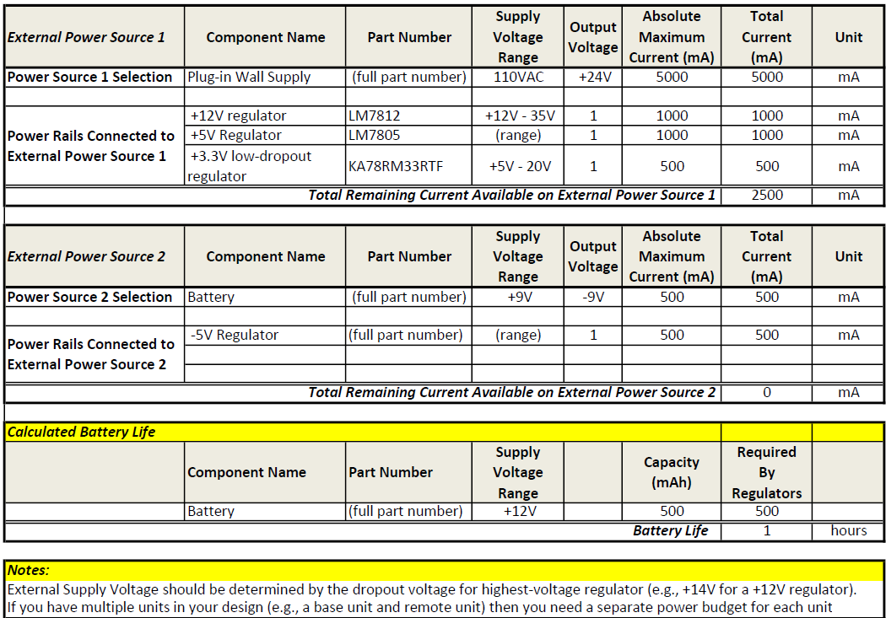

---
title: Power Budget
---

# Power Budget

## Overview

The power budget was created to estimate the electrical requirements of the **B1 Propulsion subsystem** for Team 201's project, **The Duck**. The purpose of the power budget was to check whether the selected regulators and power rails could support the ESP32 controller, motor-driver logic, and motor loads.

The propulsion board was designed around two main regulated rails:

1. **3.3 V logic rail** for the ESP32-S3-WROOM-1-N4 and low-voltage logic-side circuitry.
2. **6 V motor rail** for the propulsion motors and motor-driver power stage.

The original design intent was for the PCB to operate as a standalone board, where the input power would be regulated down to both logic and motor voltages. During final testing, the **6 V rail worked**, but the **3.3 V rail did not work** because of a routing/layout problem around the regulator and inductor path. Because of that issue, the ESP32 was powered and tested using a breadboard/devkit setup instead of relying on the failed onboard 3.3 V rail.

## Power Budget Images

The following images show the power-budget spreadsheet used for the propulsion subsystem.

{ width="700" }

{ width="700" }

{ width="700" }

## How the Power Budget Was Used

The power budget was used to compare expected current draw against the current capacity of the selected regulators. This was important because the propulsion subsystem includes both logic electronics and motors, which have very different power behavior.

The ESP32 and logic-side motor-driver inputs require a stable 3.3 V supply. These loads are relatively low compared to the motors, but they are sensitive to voltage stability. If the 3.3 V rail fails, the microcontroller cannot reliably boot, program, or send motor-control signals.

The motors require a separate 6 V supply because motor loads can draw much higher current, especially during startup, direction changes, or stall conditions. The 6 V rail therefore needed more current margin than the logic rail. The selected 6 V regulator provided enough margin for the final test setup, and this was confirmed by the fact that the 6 V rail worked on the final board.

## Final Power Conclusions

The main conclusion from the power-budget process is that the propulsion subsystem needed separate logic and motor rails. Combining the ESP32 logic power and motor power would have made the design less stable and harder to debug. The separate-rail design was the right architecture.

The final test results showed that the **6 V motor-power section was successful**, but the **3.3 V logic-power section failed because of implementation, not because the architecture was wrong**. The selected 3.3 V regulator was reasonable, but the PCB layout around the regulator needed to be corrected. In a future hardware revision, the 3.3 V regulator layout should be rebuilt directly from the datasheet reference layout, with special attention to the regulator, inductor, capacitors, and ground return path.

The failed 3.3 V rail also showed why test points and staged board bring-up matter. A future version should include clearly labeled test points for input voltage, 6 V, 3.3 V, ground, motor-driver logic input, and motor-driver output. This would make it much faster to isolate whether a problem is caused by the power circuit, the ESP32, the motor driver, or the load.

## Resources

The full power budget files are linked below:

- [Power Budget PDF](Power-Budget.pdf)
- [Power Budget Excel File](Power-Budget.xlsx)
