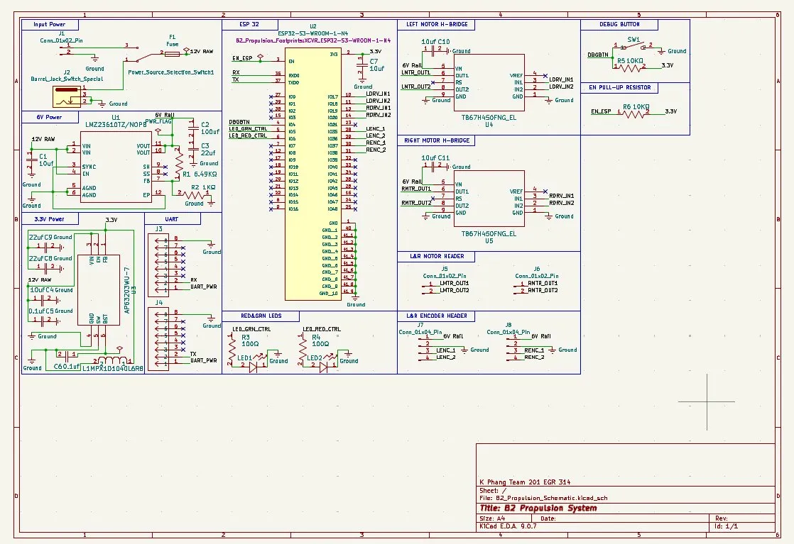

## Overview

This schematic is designed to support the B2 Propulsion subsystem. It integrates a 3.3V switching power regulator, an ESP32 WROOM-32 microcontroller, and a TB67H450FNG H-bridge motor driver to enable bidirectional PWM control of a DC gearmotor. Power is supplied via a 6V rail for motor drive and a regulated 3.3V rail for logic. UART communication is handled through the daisy-chain headers for upstream and downstream connectivity.

{style width:"350" height:"300;"}
**Figure 1:** B2 Propulsion Subsystem Schematic.

## Resources

The schematic as a PDF download is available [*here*](ExampleSchematic.pdf), and the Zip folder of the project [*here*](dummyZip.zip).
