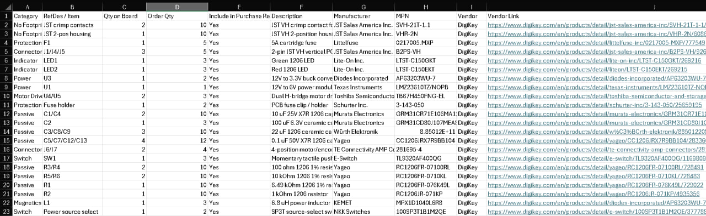

---
title: Bill of Materials
---

# Bill of Materials

## Overview

This page documents the final bill of materials for my **B1 Propulsion subsystem** for Team 201's project, **The Duck**. The BOM was created from the final schematic and purchase request for the propulsion board.

The purpose of the BOM is to identify the parts required to manufacture and assemble the propulsion PCB. It includes the major active components, power components, connectors, protection components, LEDs, passives, and support hardware needed for the board.

## Final BOM Screenshot

{ width="900" }

## Major Components

| Category | RefDes / Item | Qty on Board | Order Qty | Description | Manufacturer | MPN | Vendor |
|---|---:|---:|---:|---|---|---|---|
| Power | U3 | 1 | 2 | 12 V to 3.3 V buck converter | Diodes Incorporated | AP63203WU-7 | DigiKey |
| Power | U1 | 1 | 1 | 12 V to 6 V power module | Texas Instruments | LMZ23610TZ/NOPB | DigiKey |
| Motor Driver | U4/U5 | 2 | 3 | H-bridge motor driver | Toshiba Semiconductor and Storage | TB67H450FNG-EL | DigiKey |
| Magnetics | L1 | 1 | 3 | 6.8 uH power inductor | KEMET | MPX1D1040L6R8 | DigiKey |
| Connector | J1/J4/J5 | 3 | 5 | 2-pin JST VH vertical PCB header | JST Sales America Inc. | B2PS-VH | DigiKey |
| Connector | J6/J7 | 2 | 4 | 4-position motor/encoder header | TE Connectivity AMP Connectors | 281695-4 | DigiKey |
| Protection | F1 | 1 | 5 | 5 A cartridge fuse | Littelfuse | 0217005.MXP | DigiKey |
| Protection | Fuse holder | 1 | 2 | PCB fuse clip / holder | Schurter Inc. | 3-143-050 | DigiKey |
| Switch | Power source select | 1 | 2 | SP3T source-select switch | NKK Switches | 100SP3T1B1M2QE | DigiKey |

## BOM Notes

The BOM includes extra order quantity for several parts because small components can be lost, damaged during soldering, or needed for debugging. This is especially important for connectors, fuses, passives, and small surface-mount parts.

The purchase request includes two motor-driver reference designators, **U4/U5**, because the original schematic planned for more motor-driver capability than the final tested implementation used. The final propulsion setup used one H-bridge channel to power two TT motors, but the BOM still reflects the board design and purchase request.

The BOM also includes motor/encoder headers because the original design considered motors with encoder feedback. The final motors were basic TT DC gearbox motors without built-in encoders, so encoder feedback was not part of the final working implementation.

## Cost Summary

| Cost Item | Value |
|---|---:|
| Estimated BOM purchase total | $70.46 |

This cost includes order quantities and spare parts, not just the exact quantity assembled onto one board.

## Final Review

The BOM was sufficient for ordering and assembling the propulsion PCB, but it also shows a few areas that should be cleaned up in a future revision. The motor-driver quantity should be updated to match the final one-channel implementation, the encoder-related headers should either be justified as future expansion or removed, and the regulator support parts should be checked directly against the datasheet reference layout.

The most important BOM lesson from this board is that component selection and purchase ordering need to stay synchronized with the final implementation. The final motors did not include encoders, so the hardware and documentation needed to shift from closed-loop motor control to open-loop motor control.

## Resources

The final BOM files are linked below:

- [BOM Excel File](BOM_KPhang_Team201_EGR314.xlsx)
- [BOM PDF](BOM_KPhang_Team201_EGR314.pdf)
