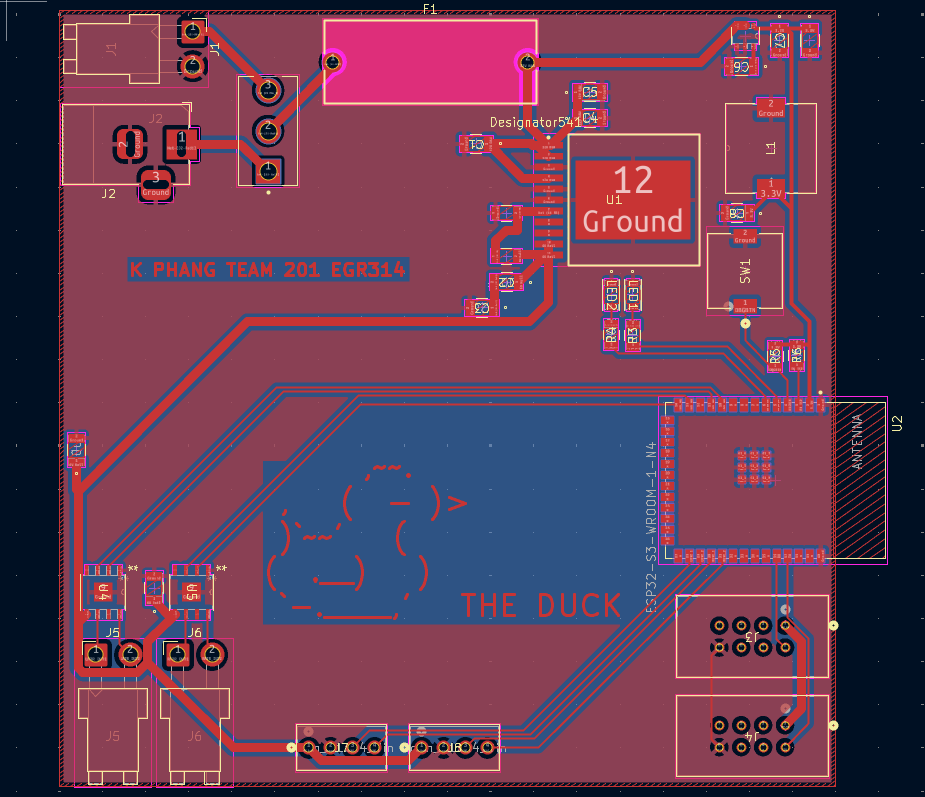
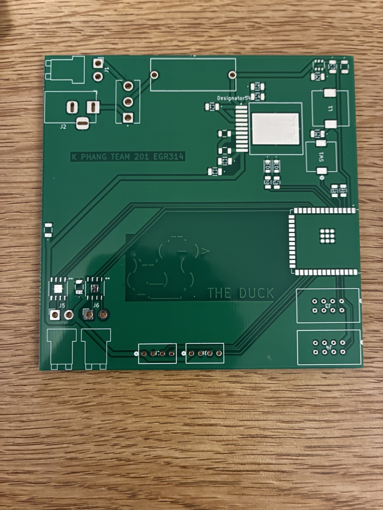
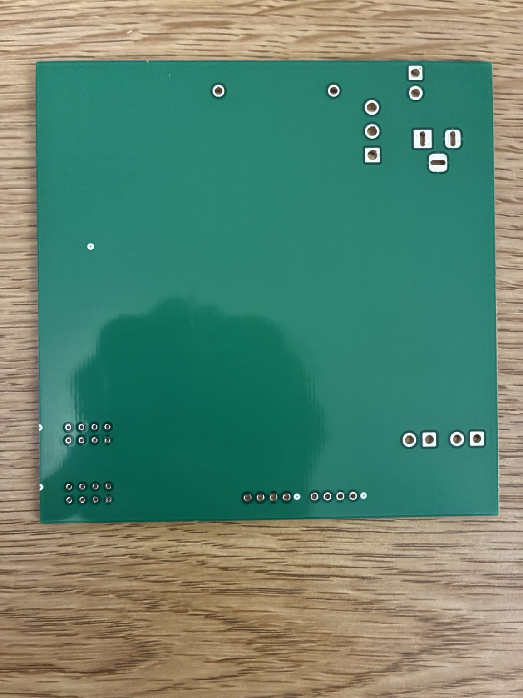
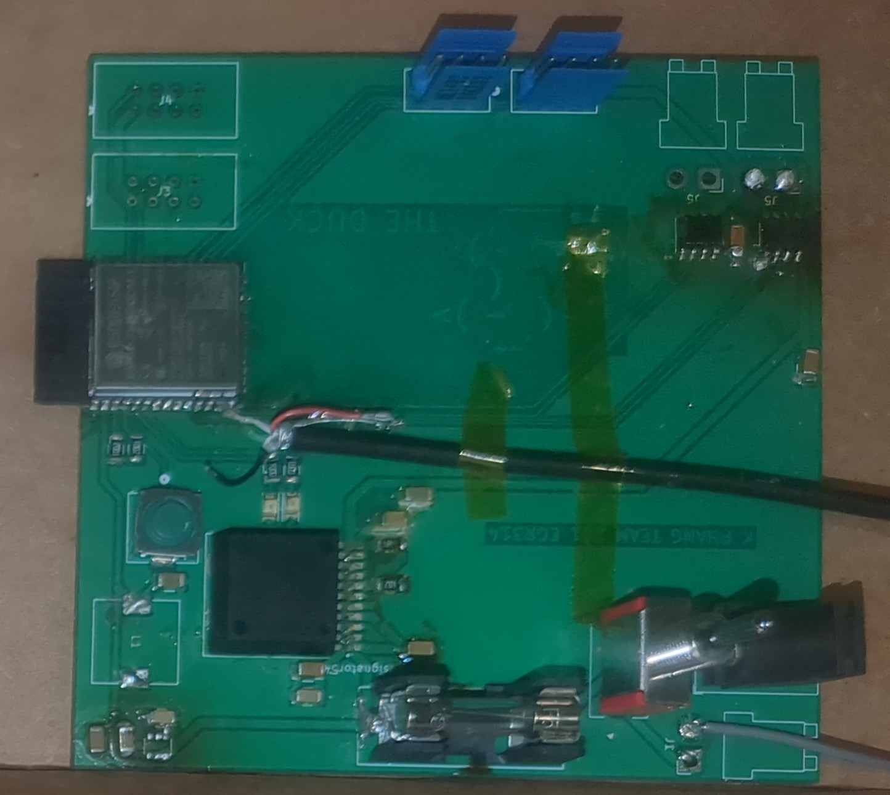
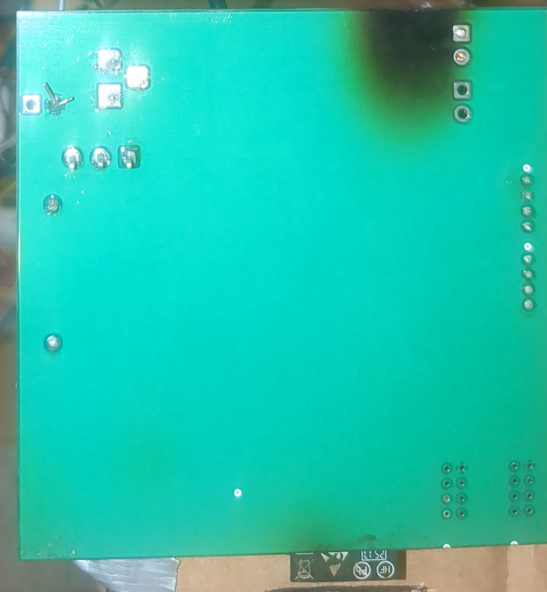

---
title: PCB Design
---

# PCB Design

## Overview

This page documents the final PCB design for my **B1 Propulsion subsystem** for Team 201's project, **The Duck**. The PCB was designed to integrate the ESP32 controller, 3.3 V logic regulator, 6 V motor rail, H-bridge motor driver, connectors, and supporting passives into a single propulsion-control board.

The final PCB was manufactured and assembled, but it did not become a fully standalone working controller. The **6 V rail worked** and was usable for motor power. The **3.3 V rail did not work** because of a layout/routing issue around the switching regulator and inductor path. The ESP32-S3-WROOM-1-N4 was soldered onto the board, but because of missing programming-header support and the failed 3.3 V rail, final testing required an external ESP32 breadboard/devkit setup.

## Final PCB Design from ECAD

The image below shows the final PCB layout from KiCad. This is the board design that was used for fabrication.

{ width="900" }

**Figure 1:** Final B1 Propulsion PCB design from KiCad.

A separate bottom-side ECAD screenshot was not available because the final documentation was captured from the main KiCad PCB layout view. The fabricated board back side is shown in the raw PCB section below.

{ width="900" }

**Figure 2:** ECAD reference image for the PCB design.

## Raw PCB Before Population

The following images show the manufactured raw PCB before components were populated.

{ width="700" }

**Figure 3:** Raw B1 Propulsion PCB front side before population.

{ width="700" }

**Figure 4:** Raw B1 Propulsion PCB back side before population.

## Final Populated PCB

The following images show the populated PCB after soldering.

{ width="700" }

**Figure 5:** Populated B1 Propulsion PCB front side.

{ width="700" }

**Figure 6:** Populated B1 Propulsion PCB back side.

## PCB Bring-Up Results

The final PCB was partially successful. The **6 V rail worked**, which allowed the board to support the motor-power side of the propulsion system. This confirmed that the motor-power section of the design was usable.

The **3.3 V rail did not work**. The issue was traced to the regulator layout/routing, specifically the inductor path and grounding around the 3.3 V switching regulator. Because the ESP32 and logic-side motor-driver circuitry require 3.3 V, this prevented the board from operating as a complete standalone propulsion controller.

The board also had a missing programming-header issue. The ESP32-S3-WROOM-1-N4 was soldered onto the PCB, but programming and debugging access was not properly designed into the board. To continue testing, an external ESP32 breadboard/devkit setup was used, and data/control wires were connected manually where possible.

## Final PCB Review

The PCB successfully demonstrated the physical integration of the propulsion subsystem into a manufactured board. It included the intended major sections: power regulation, ESP32 controller area, H-bridge motor driver, motor connectors, communication headers, and board labeling.

The main failures were related to bring-up and testability. The board needed better debug access, especially for programming the ESP32 and probing the power rails. A future PCB revision should include:

1. A dedicated ESP32 programming header.
2. Clearly labeled 3.3 V, 6 V, input voltage, and ground test points.
3. Status LEDs for each power rail.
4. A corrected 3.3 V regulator layout based directly on the datasheet reference design.
5. More conservative routing around the regulator, inductor, and ground return path.
6. Clear separation between motor-power routing and logic-signal routing.

## PCB Files

The final PCB-related files are linked below:

- [Final ECAD Project ZIP](KPhang_B1_ECAD_Project.zip)
- [Gerber / JLCPCB Fabrication ZIP](KPhang_B1_Gerbers.zip)
